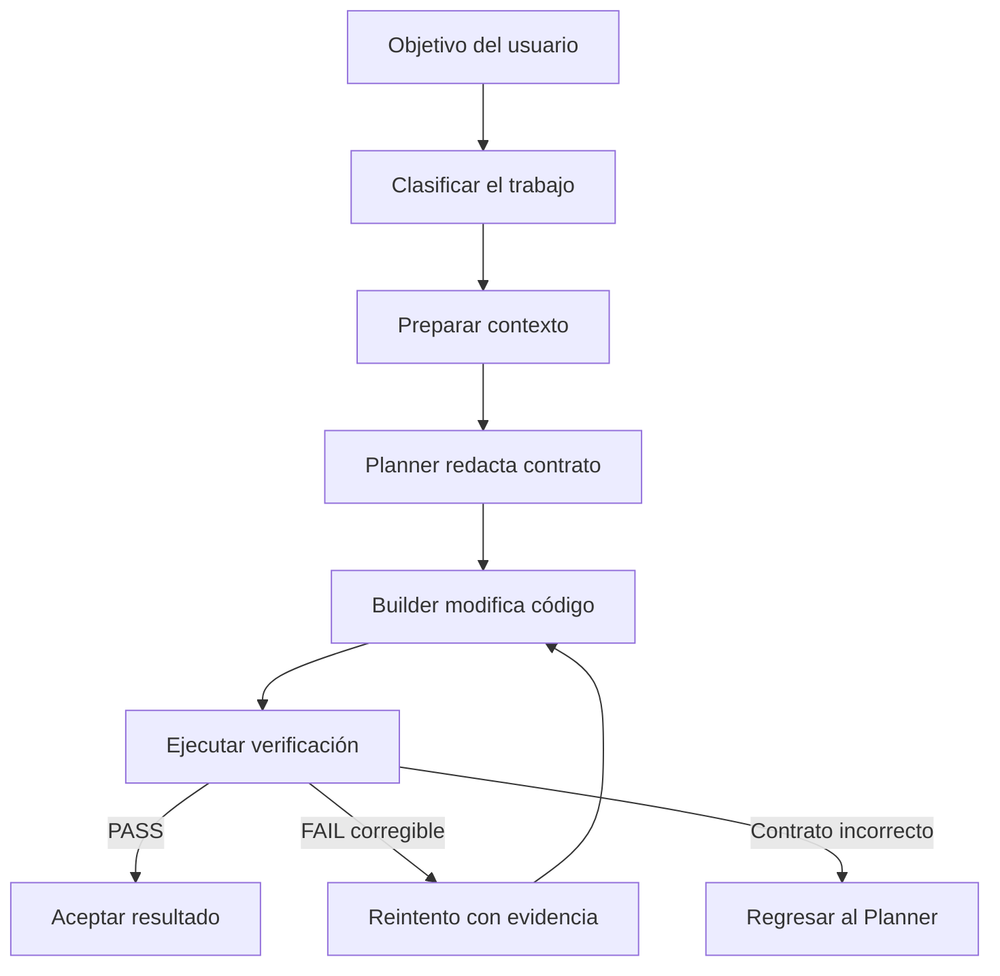
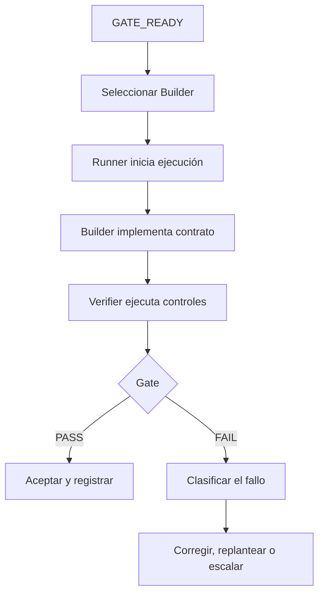
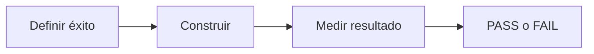
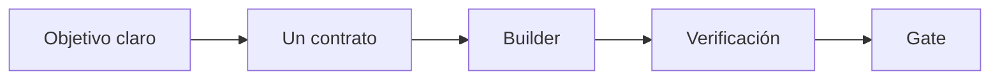
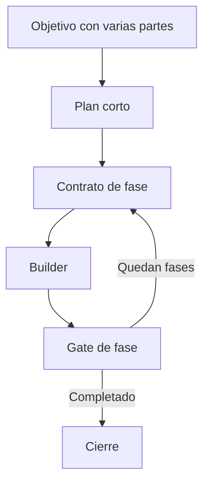
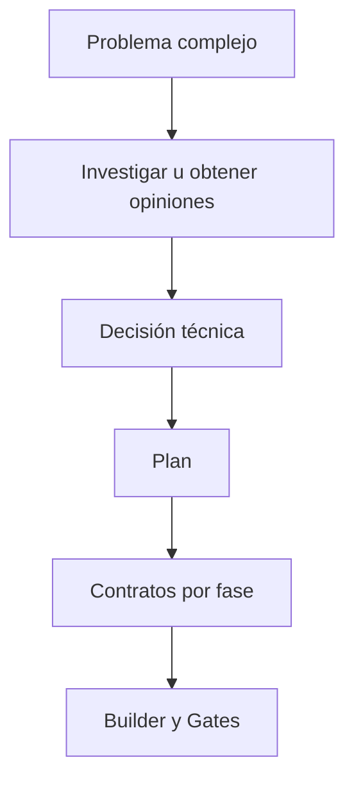
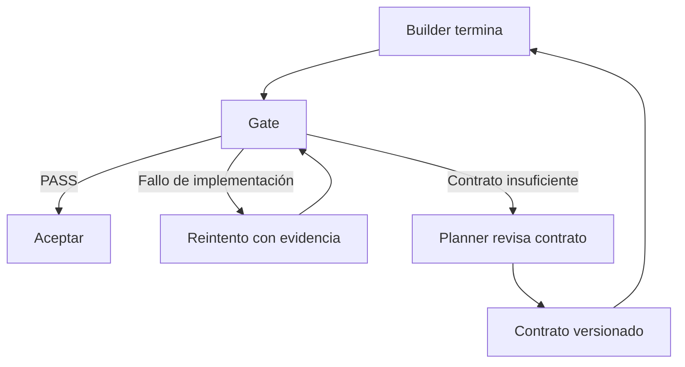
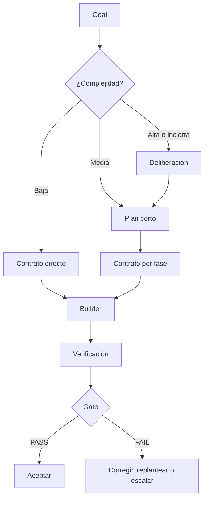

# Flujo para la generación de código

**Estado:** diseño conceptual<br>
**Proyecto:** evolución simplificada de ADW Hybrid

## 1. Objetivo

Este documento explica cómo convertir una petición del usuario en código verificado, sin aplicar un proceso pesado a todas las tareas.

La base del sistema es:

```text
objetivo → contrato → Builder → cambios → verificación → decisión
```

El sistema puede investigar, debatir o dividir el trabajo cuando sea necesario, pero esas actividades no forman parte obligatoria de cada cambio.

---

## 2. Flujo general



La clasificación inicial determina cuánto trabajo se necesita antes de redactar el contrato. No cambia el núcleo Planner–Contrato–Builder.

Este documento enumera el flujo completo para ubicar cada concepto, pero el workflow operativo que se detallará primero comienza en `GATE_READY`. La investigación, las opiniones, la planificación y la preparación del Gate pertenecen a la etapa anterior.

---

## 3. Roles del sistema

Los roles describen responsabilidades lógicas. **Un rol no equivale necesariamente a un agente, modelo o llamada independiente.** Un mismo orquestador o modelo puede cubrir varios roles cuando hacerlo no compromete la independencia de la verificación.

| Rol | Responsabilidad | Uso |
|---|---|---|
| Usuario / Goal Owner | Define el resultado que se desea obtener | Siempre |
| Router / Clasificador | Escoge ruta directa, planificada o deliberativa | Siempre, pero puede ser lógica ligera |
| Researcher | Investiga documentación, alternativas o información externa; cita fuentes que el sistema recupera y contrasta | Solo cuando falta conocimiento |
| Advisors / Opinion Agents | Producen análisis independientes sobre decisiones difíciles | Solo en alta incertidumbre o riesgo |
| Reconciler | Compara opiniones y fija una decisión técnica | Solo cuando hubo opiniones múltiples |
| Planner / Engineer | Inspecciona el repositorio, diseña el cambio y redacta el contrato | Siempre |
| Gate Designer / Test Agent | Define o prepara la verificación ejecutable | Cuando no bastan los tests y controles existentes |
| Model Selector | Escoge la configuración admitida más barata para el trabajo: lista del rol por nivel de proveedor y precio, corregida por el metalog del proyecto | Siempre, puede ser una regla del orquestador |
| Runner | Adapta la ejecución al proveedor o CLI seleccionado | Siempre como capa técnica |
| Builder | Lee el contrato y escribe o edita el código | Siempre |
| Verifier | Ejecuta la verificación oficial de forma controlada | Siempre |
| Gate Evaluator | Convierte la evidencia en PASS o FAIL | Siempre, normalmente lógica determinista |
| Reviewer | Evalúa requisitos semánticos no cubiertos por el Gate | Solo cuando sea necesario |
| Orchestrator | Controla estados, reintentos con evidencia, parada por falta de progreso y escalamiento | Siempre |
| State Recorder | Actualiza contrato, resultados, bitácora y estado recuperable | Siempre, normalmente parte del orquestador |

### Roles que pueden compartir componente

- Router, Model Selector, Gate Evaluator y State Recorder pueden ser funciones del Orchestrator.
- Planner y Gate Designer pueden ser el mismo modelo en una tarea directa.
- Researcher, Advisors y Reconciler pueden ser omitidos por completo.
- Runner no razona: traduce una solicitud común al CLI o API del modelo elegido.
- Builder y Verifier no deben compartir la autoridad final. El Builder puede ejecutar tests para autocorregirse, pero la verificación oficial se ejecuta de forma controlada fuera de su propia conclusión.

Esta separación permite conservar responsabilidades claras sin reconstruir la multiplicación de agentes de ADW Hybrid.

---

## 4. Workflow operativo desde `GATE_READY`

La generación de código comienza formalmente cuando el sistema alcanza el estado:

```text
GATE_READY
```

Para llegar a ese estado deben existir:

- un contrato sellado y versionado;
- archivos permitidos y prohibidos;
- criterios de aceptación definidos;
- una comprobación ejecutable por cada requisito automatizable del contrato;
- un Gate capaz de producir PASS o FAIL;
- una comprobación, requisito por requisito, de que cada comprobación puede ejecutarse y no acepta trivialmente cualquier resultado: la que cubre un cambio falla en el baseline, la que cubre un comportamiento conservado pasa;
- estado conocido del repositorio.

`GATE_READY` no significa que el Gate ya pasó. Significa que **la forma de juzgar el resultado está lista antes de programar**.

El Gate oficial no debería depender exclusivamente de tests inventados por el mismo Builder. Si el nuevo comportamiento no tiene cobertura previa, el Planner o Gate Designer debe preparar una comprobación independiente, o definir assertions suficientemente concretas antes de iniciar la ejecución.

### Flujo principal



### Secuencia detallada

1. El Orchestrator confirma que el contrato y el Gate están listos.
2. El Model Selector elige el Builder admitido más barato para esa clase de trabajo. La primera vez que el proyecto usa una configuración, una comprobación de encaje de segundos confirma que escribe un archivo con sus herramientas; si no encaja, queda excluida en ese proyecto.
3. El Runner crea la ejecución y entrega contrato y contexto.
4. El Builder lee los archivos autorizados y realiza la implementación.
5. El Builder puede ejecutar tests para autocorregirse.
6. El Builder devuelve cambios, estado y evidencia; no decide la aceptación final.
7. El Verifier ejecuta nuevamente los controles oficiales.
8. El Gate Evaluator produce `PASS` o `FAIL`.
9. Con `PASS`, el Orchestrator acepta el resultado y registra el estado.
10. Con `FAIL`, el Orchestrator clasifica la causa antes de decidir el siguiente paso.

### Clasificación del fallo

| Tipo de fallo | Ejemplo | Destino |
|---|---|---|
| Implementación | Test falla por lógica incorrecta | Builder recibe evidencia y reintenta |
| Contrato | Falta una decisión o requisito contradictorio | Regresa al Planner |
| Gate | Test defectuoso o criterio imposible | Gate Designer corrige la verificación |
| Contexto | Faltó un archivo necesario | Planner revisa alcance y contrato |
| Integración | El commit de un contrato choca en la rama de integración | Reconstruir sobre el head integrado con las rutas en conflicto como evidencia; Planner si el Gate ya no cuadra |
| Gate final | Contratos que pasan solos fallan juntos | Atribuir por reproducción, contrato de reparación compuesto; Planner si es inconcluso |
| Herramienta/proveedor | Timeout, CLI roto o rate limit | Detener y escalar con evidencia |
| Saldo Zen | Créditos insuficientes tras agotar Go | Detener, conservar estado y pedir recarga |
| Capacidad | El Builder reproduce un intento anterior (sin progreso) | Model Selector sube un peldaño: la siguiente configuración de la lista recibe la evidencia acumulada sobre el contrato sellado |

El sistema nunca debe tratar todos los `FAIL` como un motivo para repetir exactamente la misma llamada.

### Trabajo derivado

El objetivo inicial no es la unica fuente de trabajo. Durante construccion,
verificacion o integracion, el Orchestrator puede descubrir una correccion
adicional necesaria para completar el objetivo. Ese hallazgo vuelve a pasar por
el Router y puede convertirse en un contrato directo sin invocar al Planner
pesado cuando cumple todas estas condiciones:

- permanece dentro del objetivo y alcance autorizados;
- es pequeno y localizado;
- su riesgo ya fue aceptado por el usuario (el de los contratos aprobados de
  los que deriva; una reparación nunca sube el riesgo por su cuenta);
- no cambia arquitectura, dependencias, APIs ni decisiones de producto;
- tiene archivos permitidos concretos y un Gate existente.

El contrato derivado registra el contrato padre y la evidencia que lo origino.
Un hallazgo ya reparado no se repara dos veces. Si alguna condicion falla, el destino es `REPLAN_REQUIRED`,
`USER_DECISION_REQUIRED` o registro sin ejecucion. El Orchestrator nunca debe
usar esta via para ampliar silenciosamente el alcance ni para crear una cadena
ilimitada de reparaciones.

### Reparación tras integrar

Que cada contrato pase por separado no garantiza que pasen juntos. Dos fallos
aparecen solo después de integrar, y ninguno de los dos termina la corrida por
sí solo: primero se diagnostica sin modelo, después se repara con lo que ya
existe, y el Planner interviene solo cuando los hechos no bastan.

**Conflicto de integración.** El Orchestrator incorpora los commits de una
oleada uno a uno a la rama de integración; es el único que mueve esa rama. Si
un commit choca, anota las rutas en conflicto antes de abortar (son la
evidencia), integra el resto de la oleada y reconstruye el contrato en
conflicto: el mismo contrato sellado, en un worktree nuevo sobre el head ya
integrado, con las rutas y el parche original como evidencia para el Builder.
Un commit cuyo padre es el head no puede volver a chocar. Por construcción un
conflicto es casi imposible (el validador impide solapes dentro de una oleada y
el commit solo lleva rutas permitidas): si ocurre, señala un hueco del
validador o un cambio ajeno en la rama, no un error del Planner. Al Planner
cuando, sobre el nuevo head, las comprobaciones ya no se comportan como el
contrato exige (dos contratos hicieron el mismo trabajo), el Builder devuelve
`BLOCKED` o agota la escalera.

**Fallo del Gate final.** El Gate final dice qué comprobaciones de qué
contrato fallan sobre el árbol integrado, no qué commit las rompió. El
Orchestrator lo atribuye reproduciendo esas comprobaciones a lo largo de la
rama de integración: primero el contrato solo sobre su base (debe pasar),
después cada contrato de su misma oleada integrado antes que él, después cada
head posterior; el primer paso donde fallan nombra al culpable. Un comando de
`final_verification` del plan se reproduce desde la revisión base y necesita
un head donde pasó antes de uno donde falla. Si nada pasa nunca, o el fallo no
se reproduce, la atribución es inconclusa y va al Planner. Un diff fuera de la
huella aprobada es defecto del harness: `BLOCKED`.

Con culpable, el Orchestrator compone un contrato de reparación a partir de
los dos contratos implicados, ambos ya aprobados: todas sus comprobaciones
viajan con él; las que el Gate final vio fallar cubren requisitos `change`
(fallan sobre el head de integración y deben pasar), las demás `preserve`. El
alcance es la unión de las rutas de ambos, el riesgo el mayor de los dos:
nada que el usuario no haya aceptado. El Router del trabajo derivado lo admite,
la preparación del Gate lo verifica sobre el head, el Builder recibe la
evidencia (salidas del Gate, la reproducción, los parches), el Orchestrator
commitea, integra y repite el Gate final completo.

**Cuándo interviene el Planner.** Cuando la atribución es inconclusa, cuando
el contrato compuesto no se puede preparar, cuando el Router lo rechaza, o
cuando su Builder devuelve `BLOCKED` o agota la escalera. El Planner trabaja
sobre el árbol integrado (el worktree de integración es su repositorio), recibe
la evidencia del fallo, y escribe un plan de reparación con base en el head de
integración y contratos nuevos. Ese plan se valida como cualquier otro, salvo
que no debe cubrir el Goal entero, y corre sobre lo ya integrado. En ruta
planificada el usuario lo revisa siempre, como revisó el original; en ruta
directa solo cuando contradice lo aprobado (riesgo mayor, rutas fuera de la
huella). La corrida se pausa y se reanuda sobre su propia rama de integración.

**El Goal no cambia.** Ninguna reparación edita el Goal; lo que cambia, y por
eso se aprueba, es el plan. Si el Planner concluye que el Goal no se cumple
sin una decisión de producto, devuelve `BLOCKED` y decide el usuario.

**Parada.** Sin contadores (§9.3). Cada ronda del Gate final tiene una firma:
sus razones y las comprobaciones fallidas por contrato. Una ronda que
reproduce la firma de otra anterior se repararía con la misma evidencia, así
que la corrida para ahí con todo conservado (cubre el ping-pong entre dos
contratos). Un hallazgo (culpable y comprobaciones) reparado una vez no se
repara dos veces. Pedir al Planner un plan de reparación por el mismo fallo
del mismo contrato le daría los mismos hechos: también para ahí. Se conservan
siempre los worktrees, la rama, la secuencia de integración y los datos de
cada ronda.

### Admisión, orden y metalog

Una configuración está admitida para una clase de trabajo cuando figura en su
ruta del registro. Esa lista se arma con benchmarks públicos de código y uso de
herramientas, no con corridas propias; es un filtro ("estos modelos saben
programar"), no un orden. El orden dentro de un rol lo calcula el código y
nadie lo escribe a mano: primero por nivel de proveedor (la suscripción OpenAI
del usuario para el Planner y el Goal Manager, después OpenCode Go, después
Zen) y dentro de cada nivel del más barato al más caro, con el precio por
millón de tokens de la tabla (entrada más salida; la caché desempata). El
sistema empieza por el más barato capaz.

Cada proyecto lleva un metalog: una línea por llamada a un modelo, con el rol,
la configuración, su puesto en la lista, la lista completa, el resultado y su
motivo. El selector lo lee. La primera vez que el proyecto usa una
configuración, una comprobación de encaje de segundos confirma que escribe un
archivo con el contenido pedido usando sus herramientas; si falla, la
configuración queda excluida en ese proyecto. Un fallo atribuible al modelo
(sin progreso, artefacto inválido, fuera de alcance, formato) cuenta; una cuota
agotada, una credencial, un proveedor caído o un contrato bloqueado nunca
cuentan. Con un número fijo de fallos seguidos en un rol (dos, visible en el
registro) la configuración baja al final de la lista hasta que vuelve a
acertar. Si nadie leyera el metalog, la lista se pudriría; por eso lo lee el
selector, no una persona.

El selector escoge primero una configuración Go que cumpla todos los requisitos.
Si ninguna es suficiente, puede escoger directamente un modelo exclusivo de
Zen. El pago después de los límites de Go lo resuelve `Use balance` dentro del
mismo endpoint y nunca provoca una nueva selección:

```text
OpenCode Go
  ├─ cuota Go disponible → consume la suscripción
  ├─ límite Go + Use balance → continúa el mismo modelo contra saldo Zen
  ├─ saldo Zen agotado → USER_ACTION_REQUIRED y pedir recarga
  └─ error técnico o de ejecución → detener y clasificar

Sin Go capaz → seleccionar Zen por capacidad antes de ejecutar
```

El runtime no cambia de modelo por un fallo técnico: un timeout local, una
credencial inválida, un modelo mal configurado, una cuota agotada, un proveedor
caído o un cambio parcial detienen la corrida y se clasifican. Sí sube un
peldaño cuando el modelo deja de progresar (§9.3): la siguiente configuración de
la lista recibe la evidencia acumulada sobre el contrato sellado, y la corrida
para cuando la lista se agota. OpenRouter queda fuera de las rutas automáticas.

### Estados mínimos

```text
GATE_READY
→ BUILDING
→ VERIFYING
→ PASSED

o

GATE_READY
→ BUILDING
→ VERIFYING
→ FAILED
→ RETRY | REPLAN | REPAIR_GATE | ESCALATE | BLOCKED
```

---

## 5. Conceptos fundamentales

### 5.1 Objetivo

El objetivo describe el resultado que quiere el usuario en lenguaje de producto o de proyecto.

Ejemplo:

> Impedir que se registren usuarios con un correo ya existente.

El objetivo no necesita especificar todavía archivos, funciones, tests o detalles internos. Es la intención que el Planner debe convertir en una instrucción ejecutable.

### 5.2 Router o clasificador

El Router decide **qué profundidad de proceso necesita el objetivo**.

No escribe código ni contratos. Tampoco tiene que ser un agente o un LLM independiente. Puede ser una función pequeña dentro del orquestador que aplique reglas y, cuando exista ambigüedad, pida una clasificación a un modelo.

Para clasificar no debe adivinar solamente a partir del texto del usuario. Puede utilizar metadatos y una inspección ligera del repositorio: archivos potencialmente afectados, subsistemas, tests existentes, dependencias y nivel de riesgo. La investigación profunda ocurre después únicamente si la clasificación la justifica.

Sus posibles decisiones son:

| Ruta | Cuándo se usa |
|---|---|
| Directa | Cambio claro, localizado, reversible y de bajo riesgo |
| Planificada | Varias partes o dependencias, pero solución generalmente conocida |
| Deliberativa | Alta incertidumbre, arquitectura, bug sistémico o riesgo importante |

La decisión deliberativa se toma sobre un Goal sin sellar y se ejecuta antes
del sello (investigar, opinar, decidir, revisar el Goal, aprobar). El Router
que ve el Orchestrator solo enruta Goals sellados, a directa o planificada; un
Goal abierto lo devuelve como "necesita deliberación" con lo que le falta,
nunca como una ruta que el Orchestrator ejecute.

El Router evita que una función sencilla pase por opiniones, réplicas, conciliación y múltiples fases.

La clasificación inicial es provisional: la escribe un modelo antes de que nadie
estudie el cambio a fondo. El orquestador la vuelve a juzgar con evidencia
determinista cuando la tiene, y solo hacia arriba: al validar el plan, una ruta
directa que necesita más de un contrato pasa a planificada, y el riesgo efectivo
de un contrato es el mayor entre el que declara el Planner y el suelo que
implican las rutas que puede modificar (manifiestos de dependencias, CI,
migraciones, autenticación, pagos, infraestructura); en la preparación del Gate,
un Gate que el Goal decía existente y hubo que escribir queda registrado. Una
contradicción nunca se aplica en silencio ni baja una etiqueta aprobada: la
corrida se detiene para que el usuario revise el plan y, al aprobarlo, acepte la
ruta y el riesgo efectivos, que son los que gobiernan qué Builder se admite. La
incertidumbre de arquitectura y la necesidad de investigación externa no tienen
evidencia determinista y el código no las desmiente.

La investigación se contrasta por recuperación real: cada fuente citada se
descarga y cada hallazgo lleva un extracto literal que el sistema busca en ella.
Una fuente inexistente o ajena al título citado invalida el informe; un
extracto que no aparece deja el hallazgo sin verificar, con confianza baja, y un
informe sin ningún hallazgo verificado no responde su pregunta.

### 5.3 Planner

El Planner transforma el objetivo en un contrato ejecutable.

Para hacerlo:

1. inspecciona el repositorio;
2. localiza los archivos relevantes;
3. comprende el comportamiento actual;
4. resuelve o identifica ambigüedades;
5. define el cambio esperado;
6. define cómo se comprobará;
7. establece límites para el Builder.

En una ruta directa produce un único contrato. En una ruta planificada produce primero un plan corto y después un contrato por fase real.

El plan ejecutable se representa como un DAG de fases. Una fase contiene uno o
varios contratos sin solapamiento de escritura; sus contratos pueden ejecutarse
en paralelo. Dos fases sin relación de dependencia también pueden compartir una
oleada, siempre que sus contratos no modifiquen rutas solapadas. El validador
determinista calcula estas oleadas y rechaza ciclos o paralelismo inseguro antes
del despacho.

El plan también debe dar cuenta del Goal. Cada requisito de contrato declara qué
requisitos y criterios de aceptación del Goal cubre. El validador rechaza un plan
que deje sin cubrir un requisito obligatorio del Goal o un criterio de aceptación
automatizable; un plan rechazado vuelve al Planner con los errores como
evidencia mientras los errores cambien; si un plan reproduce los errores de un
intento anterior, la corrida para por falta de progreso. Los requisitos no obligatorios sin cubrir y
los criterios que solo un humano puede verificar se reportan, no bloquean. El
plan validado se rinde en un documento legible que, en la ruta planificada, el
usuario revisa y aprueba antes de que ningún Builder programe.

El Planner no implementa el cambio. Su producto es una especificación suficientemente precisa para que otro modelo pueda programar sin rediseñar la tarea.

### 5.4 Contrato

El contrato es la especificación cerrada que recibe el Builder.

No es solamente un prompt descriptivo. Es el acuerdo verificable que establece:

- qué debe conseguirse;
- qué contexto debe leerse;
- qué archivos pueden modificarse;
- qué archivos o comportamientos están protegidos;
- qué requisitos debe cumplir el resultado;
- cómo se verificará;
- qué autoridad tiene el Builder;
- qué debe responder cuando termine o se bloquee.

Ejemplo:

```yaml
contract_id: user-email-uniqueness
objective: Impedir registros con correos existentes.

read:
  - src/users/service.ts
  - src/users/repository.ts
  - tests/users/register.test.ts

allowed_to_modify:
  - src/users/service.ts
  - tests/users/register.test.ts

forbidden:
  - src/database/migrations/**
  - package.json

requirements:
  - id: R1
    statement: consultar el correo antes de crear el usuario
    kind: change            # añade comportamiento: su comprobación falla antes del cambio
    verification: automated
    covers: [REQ-1, ACC-1]  # ids del Goal que este requisito satisface
  - id: R2
    statement: devolver el error de dominio EmailAlreadyExists
    kind: change
    verification: automated
    covers: [REQ-1, ACC-1]
  - id: R3
    statement: conservar el comportamiento para correos nuevos
    kind: preserve          # conserva comportamiento: su comprobación ya pasa antes del cambio
    verification: automated
    covers: [REQ-2]
  - id: R4
    statement: el mensaje de error es comprensible para el usuario final
    verification: manual    # ninguna comprobación lo juzga; queda pendiente de verificación humana

verification:
  checks:
    - id: C1
      covers: [R1, R2]
      command: npm test -- tests/users/register.duplicate.test.ts
    - id: C2
      covers: [R3]
      command: npm test -- tests/users/register.test.ts
  invariants:
    - no cambiar firmas públicas
    - no modificar archivos fuera del alcance

response:
  - estado final
  - archivos modificados
  - resultado de tests
  - bloqueos o decisiones pendientes
```

Cada requisito automatizable tiene al menos una comprobación que lo cubre. El
comportamiento esperado de una comprobación antes de programar no se declara:
se deriva de los requisitos que cubre. Una que cubre un cambio debe fallar en el
baseline; una que ya pasaba antes del cambio es una guarda, nunca prueba de
cobertura. Un requisito que ningún comando puede juzgar se declara manual, no
lleva comprobación y se reporta como pendiente de verificación humana; un
contrato solo de requisitos manuales no tiene Gate y se rechaza. Un contrato
cuyos requisitos son todos de conservación es un refactor puro: se admite y se
señala como tal.

Durante la ejecución, el Builder no puede reinterpretar o ampliar unilateralmente el contrato.

### 5.5 Builder

El Builder es el modelo encargado de escribir y editar código.

Su trabajo es:

1. leer el contrato;
2. inspeccionar el contexto autorizado;
3. implementar el cambio;
4. ejecutar las comprobaciones permitidas;
5. corregir errores con la evidencia de las comprobaciones;
6. entregar el resultado y la evidencia.

El Builder puede tomar decisiones locales de implementación, como escoger nombres internos o reorganizar una función si eso no altera el contrato.

El Builder no puede:

- cambiar el objetivo;
- crear fases nuevas;
- ampliar el alcance;
- cambiar arquitectura, dependencias o APIs sin autorización;
- modificar archivos prohibidos;
- reducir los criterios de aceptación;
- declarar que un fallo es aceptable.

Si el contrato no puede cumplirse como está escrito, debe devolver:

```yaml
status: BLOCKED
reason:
evidence:
missing_decision:
recommended_contract_change:
```

### 5.6 Verificación

La verificación es el **proceso de reunir evidencia objetiva** sobre el resultado producido por el Builder.

Puede incluir:

- ejecutar tests existentes;
- ejecutar tests nuevos requeridos por el contrato;
- compilar;
- ejecutar linters o chequeos de tipos;
- comprobar archivos modificados;
- inspeccionar que no se hayan cambiado APIs protegidas;
- revisar requisitos semánticos que no puedan automatizarse.

La verificación no es necesariamente otro agente. Siempre que sea posible debe consistir en comandos y comprobaciones deterministas.

El Builder puede ejecutar tests durante su trabajo, pero esa ejecución es autocontrol. Al finalizar, el orquestador debe ejecutar nuevamente la verificación oficial o recogerla mediante un mecanismo controlado. Así el mismo modelo no es quien produce el cambio y certifica de manera exclusiva su validez.

### 5.7 Gate

El Gate es la **decisión de aceptación** que utiliza los resultados de la verificación.

```text
verificación = producir evidencia
gate          = aplicar reglas a la evidencia y decidir PASS o FAIL
```

Ejemplo:

```text
Evidencia:
- tests: PASS
- typecheck: PASS
- archivos no autorizados: 0
- requisito EmailAlreadyExists: cumplido

Gate: PASS
```

El Gate no tiene que ser un agente ni un script nuevo para cada fase. Puede ser una regla del orquestador que evalúe comandos existentes y restricciones declaradas en el contrato.

Al cerrar una corrida, el orquestador cierra el ciclo contra el Goal con un
libro de cobertura: por cada requisito y criterio de aceptación del Goal, qué
contratos lo reclamaron, si pasaron y qué dijeron sus comprobaciones. Los
criterios manuales u operativos y los requisitos manuales de contrato se listan
como pendientes de verificación humana; nunca se declaran cumplidos.

### 5.8 Orquestador

El orquestador controla el flujo y el estado. No necesita programar ni redactar todo.

Sus responsabilidades son:

- invocar la clasificación;
- solicitar el contrato al Planner;
- entregar el contrato al Builder correcto;
- ejecutar o coordinar la verificación;
- aplicar el Gate;
- controlar intentos y parar cuando dejan de aportar evidencia nueva;
- devolver el fallo al componente correcto;
- registrar el estado final.

---

## 6. ¿Por qué la verificación aparece después del Builder?

Porque no puede verificarse un resultado que todavía no existe.

Sin embargo, hay que separar dos momentos:

```text
ANTES DE PROGRAMAR
se definen criterios, comandos e invariantes

DESPUÉS DE PROGRAMAR
se ejecutan esos criterios sobre el resultado real
```

El Planner define la verificación dentro del contrato antes de que el Builder escriba código. Esto evita que el Builder cambie posteriormente la definición de éxito.

Después de la implementación, el sistema ejecuta la verificación y el Gate decide.



Por tanto, la verificación aparece conceptualmente en dos lugares:

- como **diseño**, dentro del contrato y antes del Builder;
- como **ejecución**, después de que existen cambios que verificar.

---

## 7. Diferencias entre contrato, verificación y Gate

| Concepto | Pregunta que responde | Momento |
|---|---|---|
| Contrato | ¿Qué debe construir el Builder y bajo qué límites? | Antes de programar |
| Verificación definida | ¿Qué evidencia necesitaremos para comprobarlo? | Dentro del contrato |
| Builder | ¿Cómo implementamos el contrato? | Durante la programación |
| Verificación ejecutada | ¿Qué ocurrió realmente al probar los cambios? | Después de programar |
| Gate | ¿La evidencia satisface todas las condiciones? | Después de verificar |

Ejemplo sencillo:

```text
Contrato:
"Añade validación de correo duplicado y conserva la API."

Verificación definida:
"Ejecutar estos tests y comprobar que solo cambien dos archivos."

Builder:
modifica el servicio y los tests.

Verificación ejecutada:
los tests pasan y solo cambiaron los archivos permitidos.

Gate:
PASS.
```

---

## 8. Las tres rutas

### 8.1 Ruta directa



Se usa para cambios localizados y de bajo riesgo.

Características:

- un contrato, o reencaminada a la ruta planificada si el plan demuestra que no cabe en uno;
- un Builder;
- verificación determinista;
- reintento con evidencia mientras el resultado cambie; sin tope de intentos;
- sin opiniones ni fases;
- sin pausa de revisión, salvo que el plan contradiga el triaje del Goal;
- revisión adicional solo si el contrato contiene criterios no automatizables.

### 8.2 Ruta planificada



Se usa cuando existen dependencias o resultados intermedios reales.

En esta ruta el usuario revisa el plan rendido, con su cobertura del Goal, y lo
aprueba antes de que empiece la construcción. La ruta directa, con un solo
contrato, no se detiene.

Una fase debe:

- producir un cambio verificable;
- tener un límite claro;
- depender razonablemente de un estado anterior;
- poder aceptarse o corregirse sin mezclar todo el proyecto.

Código, tests y documentación de una misma función normalmente pertenecen al mismo contrato, no a tres fases.

### 8.3 Ruta deliberativa



Se reserva para:

- arquitectura nueva;
- bugs cuya causa es desconocida;
- requisitos contradictorios;
- migraciones;
- seguridad, pagos o infraestructura;
- varias alternativas con consecuencias importantes;
- fallos repetidos de una ruta más simple.

---

## 9. Límites y escalamiento

### 9.1 Límites del contrato

Cada contrato debe definir:

- alcance permitido;
- archivos protegidos;
- criterios de éxito;
- comandos de verificación;
- invariantes que no puede romper.

### 9.2 Fallo del Builder



El mismo Builder puede corregir una implementación cuando el contrato sigue siendo válido. Se regresa al Planner cuando el fallo revela que el contrato era incorrecto, incompleto o imposible.

### 9.3 Parada por falta de progreso: el sistema no fija presupuestos

Ni el Goal ni el contrato llevan topes de llamadas, intentos o revisiones, y el
sistema no impone techos propios. El coste se controla fuera, en OpenCode y en
el proveedor del modelo.

Lo que sí fija el sistema es cuándo un reintento deja de tener sentido. Un
reintento solo se hace con evidencia nueva (§4: nunca la misma llamada para el
mismo fallo). Cuando un intento reproduce el resultado de uno anterior (el
Builder deja fallando las mismas comprobaciones o toca las mismas rutas fuera
de alcance; el Planner devuelve los mismos errores de validación), el siguiente
reintento sería idéntico, y el sistema para con la evidencia acumulada. En la
práctica, la misma comprobación fallando dos veces seguidas detiene el
contrato; un Builder que avanza de verdad no tiene tope.

Después de esa parada, el sistema no repite con el mismo modelo: sube un peldaño en la lista del rol (§4, Admisión, orden y metalog), la siguiente configuración recibe la evidencia acumulada sobre el contrato sellado, y el fallo queda en el metalog del proyecto. Agotada la lista, detiene el trabajo con evidencia.

---

## 10. Quién decide cada cosa

| Decisión | Responsable |
|---|---|
| Qué quiere lograr el proyecto | Usuario / Goal |
| Qué profundidad de proceso necesita | Router u orquestador |
| Qué debe cambiarse en el repositorio | Planner |
| Qué constituye éxito | Planner, expresado en el contrato |
| Cómo implementar internamente | Builder, dentro de los límites |
| Qué evidencia produjo el resultado | Verificación |
| Si el contrato fue satisfecho | Gate |
| Si reintentar, replantear o escalar | Orquestador |
| Qué commit rompió el resultado integrado | Orquestador, por reproducción determinista |
| Cómo se reorganiza el trabajo tras un fallo de integración | Planner, con la evidencia; el usuario aprueba el plan de reparación |

---

## 11. Flujo mínimo que debe preservarse

Incluso en la tarea más sencilla deben existir cuatro elementos:

```text
1. objetivo claro
2. contrato limitado
3. Builder competente
4. verificación independiente del Builder
```

Router, opiniones, Researcher, plan por fases, Test Agent separado y review semántico son componentes condicionales.

La regla de diseño es:

> Utilizar el proceso más pequeño que produzca un contrato correcto y evidencia suficiente para aceptar el código.

---

## 12. Resumen operativo



El sistema no busca producir la mayor cantidad de planificación posible. Busca entregar cambios correctos utilizando el mínimo de coordinación necesario para el riesgo y complejidad reales.
